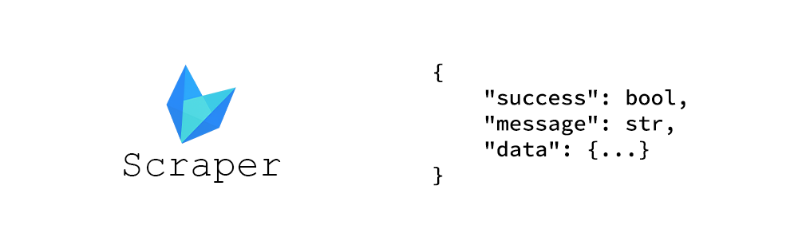

# Dlfox Scraper



**Dlfox Scraper** is a tool for extracting game data from <a href="https://dlfox.com">Dlfox</a> using web scraping.

⚠️ This project is unofficial and purely for educational purposes. No official API was used.

<br>

## 📦 Installation


```bash
git clone https://github.com/Abssdghi/dlfox_scraper.git
cd dlfox_scraper
pip install -r requirements.txt
```

<br>

## 🔧 Functions

| Function | Parameters | Description |
|----------|------------|-------------|
| `get_latest_posts(pagecount=1)` | `pagecount: int` | Fetches the latest posts from the website. Each page contains 12 posts. |
| `get_game_info(url)` | `url: str` | Extracts detailed information for a specific game using its page URL. |
| `search(keyword, pagecount=1)` | `keyword: str`, `pagecount: int` | Searches for games based on a keyword and returns a list of result URLs. |

Each function returns a structured dictionary (JSON-like).

<br>

## 🧠 Usage

Just import the scraper and call your desired function:

```python
from dlfox_scraper import *

latest_posts_response = get_latest_posts(pagecount=1)

if latest_posts_response['success'] and latest_posts_response['data']:
    first_post_url = latest_posts_response['data'][0]
    print(f"Getting info for: {first_post_url}\n")

    game_info_response = get_game_info(url=first_post_url)

    if game_info_response['success']:
        game_data = game_info_response['data']
        print(f"Title: {game_data['title']}")
        print(f"Category: {game_data['category']}")
        print(f"Size: {game_data['size']}")
        print(f"Version: {game_data['version']}")
        print(f"Parts: {game_data['parts']}")
        print(f"Poster: {game_data['images'][0]}")
    else:
        print(f"Error getting game info: {game_info_response['message']}")
else:
    print(f"Error getting latest posts: {latest_posts_response['message']}")
```

<br>

## 📄 License

This project is licensed under the [MIT License](LICENSE).

<br>

## 🌟 Give it a Star

If you found this useful, feel free to ⭐️ the repo and share it with others!

<br>

Made with 🎧 by [Abbas Sadeghi](https://github.com/abssdghi)
